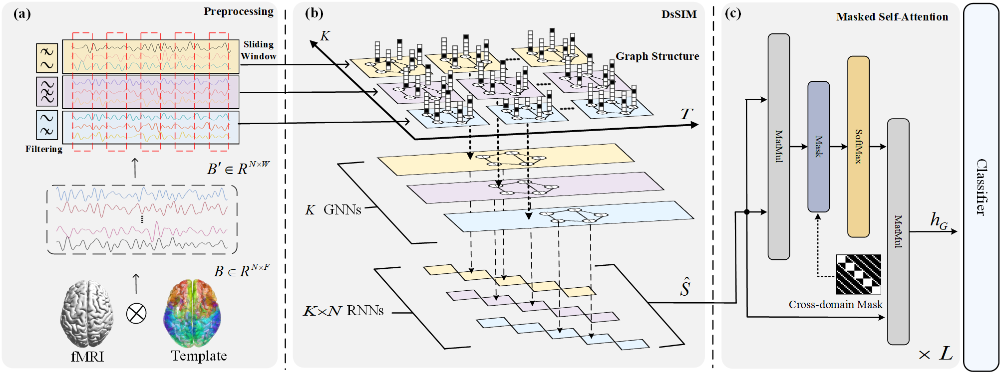

# STFreqGNN

## Paper
[**A UNIFIED SPATIOTEMPORAL FREQUENCY GRAPH NEURAL NETWORK FOR FMRI-BASED BRAIN FUNCTIONAL CONNECTIVITY ANALYSIS**](https://ieeexplore.ieee.org/abstract/document/10890520) \
Yulang Huang, Zhiyuan Ding and others \
presented at *ICASSP 2025*


## Concept


## Dataset
Example structure of the dataset directory tree.
```
data
├─── dataset1
│    ├─── raw
│    │    ├─── sub_0.pt
│    │    ├─── sub_1.pt
│    │    ├─── ...
│    │    └─── sub_xx.pt
│    │
│    └─── prcessed
│    
├─── dataset2
├─── ...
└─── datasetX
```

## Environment Creation
Run the commands to create conda environment.
```shell
conda create -n stfreqgnn python=3.11
conda activate stfreqgnn
pip install -r requirements.txt
```


## Training Models
Run the main script to perform experiments.
```shell
bash run/FTD_train.sh
```

## Reference
If you find our work useful in your research or if you use parts of this code please consider citing our [paper](https://ieeexplore.ieee.org/abstract/document/10890520).
```
@inproceedings{huang2025unified,
  title={A Unified Spatiotemporal Frequency Graph Neural Network for fMRI-based Brain Functional Connectivity Analysis},
  author={Huang, Yulang and Ding, Zhiyuan and Duan, Guokai and Liu, Yan and Zeng, Xiangzhu and Wang, Zheng and Xu, Yingying and Wang, Ling},
  booktitle={ICASSP 2025-2025 IEEE International Conference on Acoustics, Speech and Signal Processing (ICASSP)},
  pages={1--5},
  year={2025},
  organization={IEEE}
}
```
